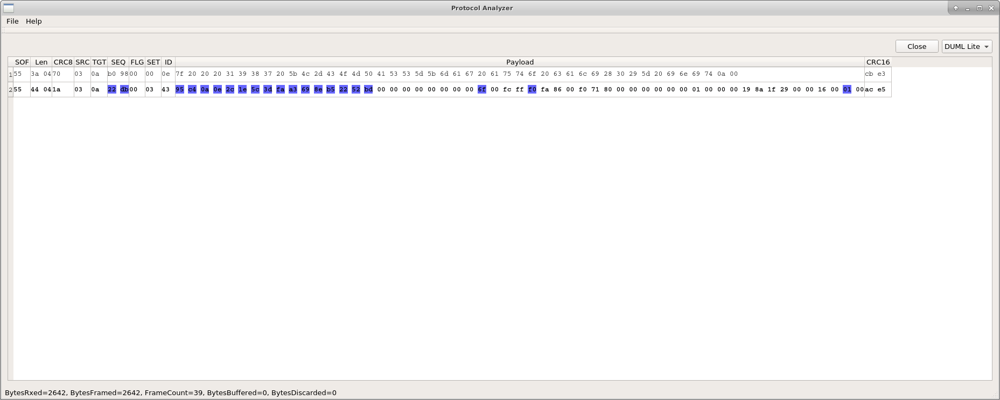

# pahsda
Protocol Analyzer Highlighting Structured Data for Analysis

Pronouned like pasta, because I like food.

# Dependencies

Requires Qt5 with QtSerialPort package

* libqt5serialport5-dev

# Building

```
cd pahsda
git submodule update --init --recursive
./build.sh
```

# Modularity

DUML Lite is a plugin for analyzing DUML traffic from DJI drones.  You can use
the files in src/plugins/dumlLite as a template for making your own plugin to
analyze different protocols.

I plan to make the IO initialization a plugin as well.

# Screenshots




